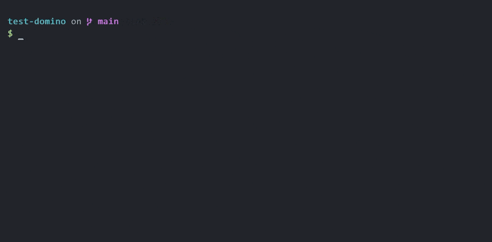
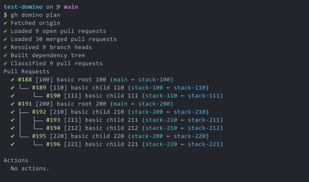
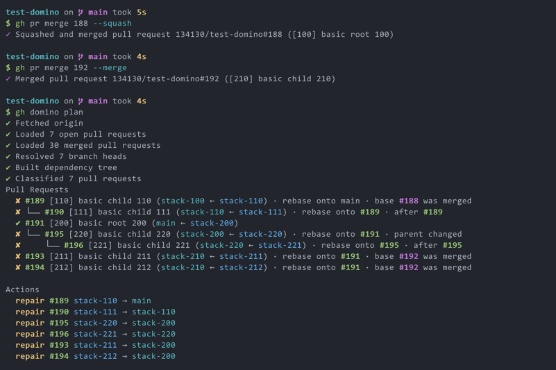
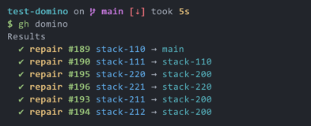
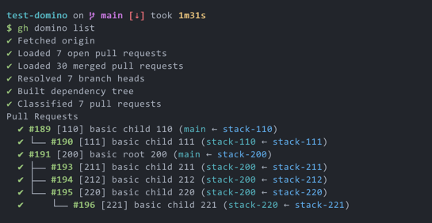

# gh-domino

A GitHub CLI extension to rebase stacked pull requests like dominoes.



## What is it?

When working with a chain of dependent pull requests (stacked PRs), merging the first PR in the stack breaks
the chain for the others. You then have to manually rebase each subsequent PR, which can be tedious.

`gh-domino` automates this process. It detects when a PR in a stack has been merged and automatically rebases
the rest of the PRs in the chain for you.

The tool works with all of GitHub's merge strategies (Merge Commit, Squash and Merge, and Rebase and Merge) automatically.

## Features

Since v3.0.0, `gh-domino` includes several utilities to make stack management safer and more predictable:

*   **Interactive TUI (`gh domino`)**: Visually inspect your stacked PRs and identify broken dependencies at a glance. **(Currently, executing rebases is only supported via the TUI).**
*   **Dry-run Planning (`gh domino plan`)**: Safely preview the exact rebase and branch update operations before making any changes.
*   **Concurrent Operations (`--parallel`)**: Process independent PR stacks in parallel for faster updates.
*   **Flexible Filtering**: Use flags like `--author` and `--merged-limit` to narrow down the target PRs.

> **Note:** The standalone `merge` command is currently under development. To perform actual rebase and update actions, please use the interactive TUI (`gh domino`).

## Installation

```bash
gh extension install 134130/gh-domino
```

## Usage

Navigate to your repository and run:

```bash
gh domino
```

## Comparison with other tools

There are several excellent tools for managing stacked PRs. `gh-domino` takes a minimalist approach, focusing solely on the rebasing step rather than managing the entire PR lifecycle.

| Feature | `gh-domino` | Graphite (`gt`) | `github/gh-stack` |
| :--- | :--- | :--- | :--- |
| **Primary Focus** | **Repairing** broken stacks (Cascading rebases) | **End-to-end** lifecycle management | **End-to-end** lifecycle management |
| **State Management** | **Stateless** (Relies on GitHub PR metadata & Git refs) | Stateful (Local & remote sync) | Stateful (Local branch tracking) |
| **Workflow Impact** | Use standard Git/GitHub commands; run only when a stack breaks | Requires adopting a custom CLI and web dashboard | Requires using custom CLI for creating/submitting PRs |
| **PR Descriptions** | Unmodified | Adds tracking metadata | Adds tracking metadata |

*(Note: Native platform features like **GitLab Stacked MRs** provide similar end-to-end management but are strictly tied to their respective ecosystems. `gh-domino` is built specifically for GitHub's API semantics.)*

## How it works

`gh-domino` operates by performing the following steps:

1. **Fetch PRs:** It fetches all open and recently merged pull requests from the `origin` remote.
2. **Build Dependency Tree:** It analyzes the base and head branches of your open pull requests to construct a dependency tree.
   This tree represents the "stacks" where one PR is based on another.
3. **Identify Broken PRs:** The tool traverses the dependency tree to find "broken" PRs. A PR is considered broken if:
   - Its base branch belongs to a pull request that has already been merged.
   - Its base branch (i.e., the parent PR in the stack) has been updated or rebased, causing the child PR to diverge.
4. **Rebase and Update:** For each broken PR, `gh-domino` will:
   - Determine the correct new base branch (for example, the base of the PR that was just merged).
   - Perform a `git rebase` of the PR's branch onto the new base.
   - Perform a `git push --force-with-lease` to update the PR branch on GitHub.
   - Finally, if necessary, it will update the base branch of the pull request on GitHub using `gh pr edit`.

This process continues down the stack, ensuring that each dependent PR is correctly rebased onto its new parent, just like falling dominoes.

### Example

Here is a tree of the stacked PRs:



After merging some PRs, you can see like this:



You can automatically rebase the remaining PRs in parallel:



Finally, the PRs are rebased and ready to be merged:



## Design Principles

`gh-domino` is built on a few core principles to ensure reliability:
1. **No Local State:** It does not use local tracking files. Remote Git branches and GitHub PR metadata are the absolute source of truth.
2. **Clean PR Bodies:** It does not append tracking IDs or metadata tags to your pull request descriptions.
3. **Explicit Execution:** It does not hijack Git hooks. It only reads and modifies branches when you explicitly execute the command.

## Related

- [gh-cherry-pick](https://github.com/134130/gh-cherry-pick) - A GitHub CLI extension to cherry-pick pull requests to another branch
- [gh-poi](https://github.com/seachicken/gh-poi) - A GitHub CLI extension to safely clean up local branches you no longer need
