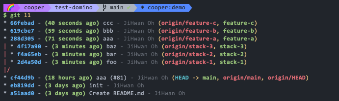
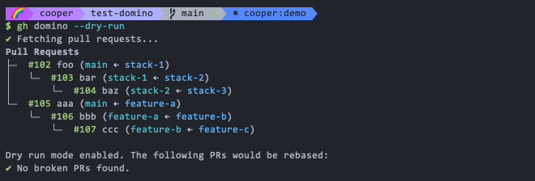

# gh-domino

A GitHub CLI extension to rebase stacked pull requests like dominoes.

## What is it?

When working with a chain of dependent pull requests (stacked PRs), merging the first PR in the stack breaks
the chain for the others. You then have to manually rebase each subsequent PR, which can be tedious.

`gh-domino` automates this process. It detects when a PR in a stack has been merged and automatically rebases
the rest of the PRs in the chain for you.

The tool works with all of GitHub's merge strategies (Merge Commit, Squash and Merge, and Rebase and Merge) automatically.

## What's different from other tools?

There are several tools that help manage stacked PRs, but `gh-domino` has some unique features:

- **Zero Configuration**: No setup or configuration is needed. Just install the extension and run it in your repository.
- **No State Management**: It doesn't require any special branch naming conventions or local state files. It works with your existing branches and PRs.
- **No Additional Descriptions on PRs**: It doesn't require you to add special tags or descriptions to your PRs.

## Installation

```bash
gh extension install 134130/gh-domino
```

## Usage

Navigate to your repository and run:

```bash
gh domino [--auto] [--dry-run]
```

### Options

- `--auto`: Automatically rebase the PRs without prompting for confirmation.
- `--dry-run`: Show what would happen without making any changes.

### Example

Here are the two of three stacked PRs:



With the `gh-domino`, you can see like this:



After merging the first PR, you can see like this:


You can automatically rebase the remaining PRs with:

```bash
gh domino --auto
```


Finally, the PRs are rebased and ready to be merged:


## How it works

`gh-domino` operates by performing the following steps:

1. **Fetch PRs:** It fetches all open and recently merged pull requests from the `origin` remote.
2. **Build Dependency Tree:** It analyzes the base and head branches of your open pull requests to construct a dependency tree. 
   This tree represents the "stacks" where one PR is based on another.
3. **Identify Broken PRs:** The tool traverses the dependency tree to find "broken" PRs. A PR is considered broken if:
   - Its base branch belongs to a pull request that has already been merged.
   - Its base branch (i.e., the parent PR in the stack) has been updated or rebased, causing the child PR to diverge.
4. **Rebase and Update:** For each broken PR, `gh-domino` will:
   - Determine the correct new base branch (for example, the base of the PR that was just merged).
   - Perform a `git rebase` of the PR's branch onto the new base.
   - Perform a `git push --force-with-lease` to update the PR branch on GitHub.
   - Finally, if necessary, it will update the base branch of the pull request on GitHub using `gh pr edit`.

This process continues down the stack, ensuring that each dependent PR is correctly rebased onto its new parent, just like falling dominoes.

## Related

- [gh-cherry-pick](https://github.com/134130/gh-cherry-pick) - A GitHub CLI extension to cherry-pick pull requests to another branch
- [gh-poi](https://github.com/seachicken/gh-poi) - A GitHub CLI extension to safely clean up local branches you no longer need
